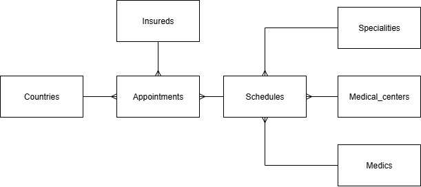
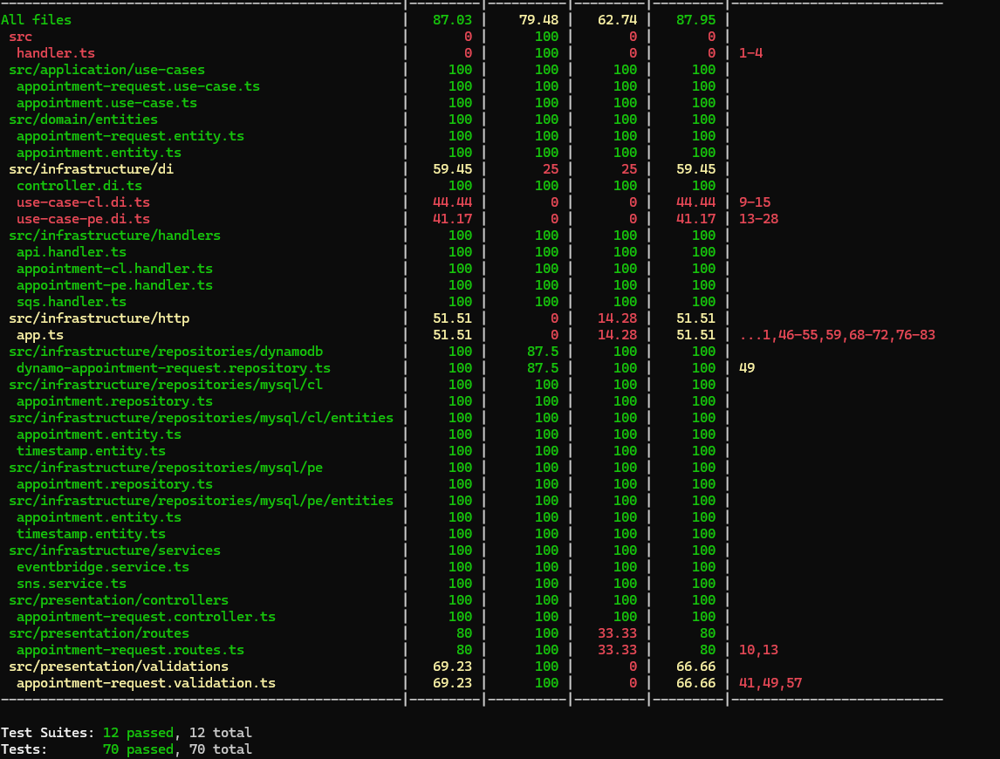

# SLS Express API

API Serverless construida con Express, TypeScript y AWS Lambda que implementa arquitectura limpia para la gestión de citas médicas.

## Características

- **Arquitectura Limpia**: Separación clara de responsabilidades entre capas
- **TypeScript**: Tipado estático para mayor robustez
- **Serverless Framework**: Despliegue y gestión de infraestructura AWS
- **Multi-región**: Soporte para múltiples países (PE, CL)
- **DynamoDB**: Base de datos NoSQL para solicitudes de citas
- **MySQL**: Bases de datos relacionales para cada región
- **EventBridge**: Comunicación asíncrona entre servicios
- **SNS**: Notificaciones y mensajería
- **Swagger**: Documentación automática de API
- **Testing**: Suite de pruebas con Jest
- **Validación**: Middleware de validación con Joi

## Estructura del Proyecto

```
src/
├── application/          # Casos de uso de la aplicación
├── domain/              # Entidades y contratos del dominio
│   ├── entities/        # Entidades de negocio
│   ├── contracts/       # Interfaces y contratos
│   └── interfaces/      # Interfaces de servicios
├── infrastructure/      # Implementación de infraestructura
│   ├── config/         # Configuración de servicios
│   ├── handlers/       # Handlers de AWS Lambda
│   ├── repositories/   # Implementación de repositorios
│   └── services/       # Servicios externos
└── presentation/       # Capa de presentación
    ├── controllers/    # Controladores HTTP
    ├── routes/        # Definición de rutas
    └── validations/   # Esquemas de validación
```

## Tecnologías

### Backend
- **Node.js 20.x** - Runtime de JavaScript
- **TypeScript** - Superset tipado de JavaScript
- **Express.js** - Framework web
- **Serverless Framework** - Framework de despliegue serverless

### Bases de Datos
- **DynamoDB** - Base de datos NoSQL para solicitudes
- **MySQL** - Bases de datos relacionales por región
- **TypeORM** - ORM para MySQL

### AWS Services
- **Lambda** - Funciones serverless
- **API Gateway** - Gateway de API REST
- **DynamoDB** - Base de datos NoSQL
- **EventBridge** - Bus de eventos
- **SNS** - Servicio de notificaciones
- **SQS** - Cola de mensajes

### Herramientas
- **Jest** - Framework de testing
- **Joi** - Librería de validación
- **Swagger** - Documentación de API
- **Prettier** - Formateador de código

## Requisitos Previos

- Node.js 18+ 
- AWS CLI configurado
- Serverless Framework CLI
- Credenciales de AWS con permisos adecuados

## Instalación

1. **Clonar el repositorio**
```bash
git clone <repository-url>
cd sls-express-api
```

2. **Instalar dependencias**
```bash
npm install
```

3. **Configurar variables de entorno**
```bash
# Crear archivo .env en la raíz del proyecto
cp .env.example .env
```

Variables requeridas:
```env
AWS_ACCOUNT_ID=your-aws-account-id
DB_HOST_PE=your-pe-db-host
DB_USERNAME_PE=your-pe-db-username
DB_PASSWORD_PE=your-pe-db-password
DB_NAME_PE=your-pe-db-name
DB_HOST_CL=your-cl-db-host
DB_USERNAME_CL=your-cl-db-username
DB_PASSWORD_CL=your-cl-db-password
DB_NAME_CL=your-cl-db-name
EVENT_BUS_NAME=your-event_bus_appointments
```

## Scripts Disponibles

```bash
# Compilar TypeScript
npm run build

# Ejecutar en modo desarrollo local
npm run dev

# Ejecutar serverless offline
npm start

# Ejecutar tests
npm test

# Desplegar a AWS
npm run deploy

# Formatear código
npm run format

# Verificar formato de código
npm run format:check
```

## Desarrollo Local

1. **Compilar y ejecutar localmente**
```bash
npm run dev
```

2. **La API estará disponible en**
```
http://localhost:3000
```

3. **Documentación Swagger**
```
http://localhost:3000/swagger.json
```

## API Endpoints

### Solicitudes de Citas

- `POST /appointment-request` - Crear solicitud de cita
- `GET /appointment-request` - Obtener solicitud de citas

### Diagrama conceptual del RDS



## Arquitectura

### Capas de la Aplicación

1. **Presentation Layer**: Controladores, rutas y validaciones
2. **Application Layer**: Casos de uso de la aplicación
3. **Domain Layer**: Entidades de negocio y contratos
4. **Infrastructure Layer**: Implementación de servicios externos

## Despliegue
```bash
npm run deploy
```

## Logs y Monitoreo

Los logs están disponibles en:
- AWS CloudWatch Logs

## Notas Importantes

- Cada región (PE, CL) tiene su propia base de datos MySQL
- Las solicitudes se almacenan en DynamoDB para acceso rápido
- Los eventos se procesan de forma asíncrona a través de EventBridge
- La validación de datos se realiza usando esquemas Joi

## Coverage

